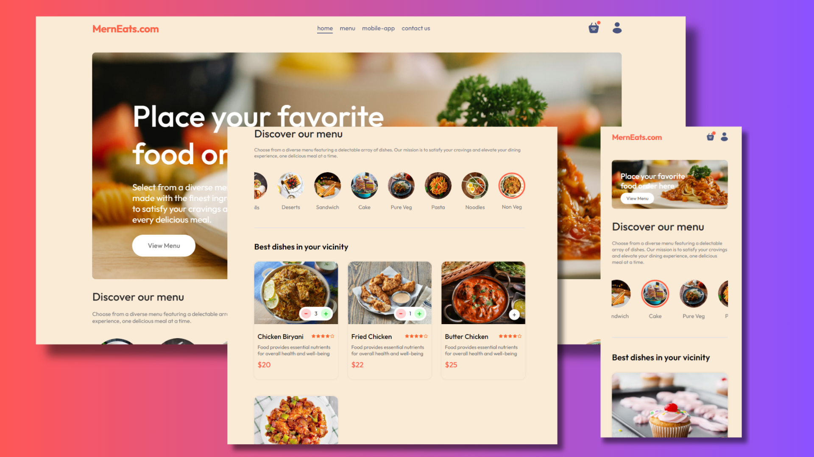

<div align="center">
    <h1>MernEats.com</h1>

This application is deployed on Render. Please check it out [here](https://merneats-0xob.onrender.com).



</div>

## Introduction

Mern-Eats.com is a full-stack web application that enables users to browse through a variety of dishes, place orders, track their order in real time and get food delivered to their doorstep efficiently. The application leverages the power of the MERN stack (MongoDB, Express.js, React.js, Node.js) to ensure a seamless user experience and robust performance.

## 🖥️ Tech Stack

**Frontend:**

&nbsp;
&nbsp;
&nbsp;

**Database:**

&nbsp;

**Payment Getway:**

&nbsp;

**Deployed On:**

&nbsp;

## Features

- **User Authentication**: Secure login and registration system.
- **Browse**: Easily browse their favourite dishes.
- **Order Placement**: Simple and intuitive process for placing orders.
- **Order Tracking**: Real-time tracking of orders from preparation to delivery.
- **Payment Gateway**: Secure payment processing.
- **Admin Dashboard**: Admin interface for managing food and orders.
- **Responsive Design**: Fully responsive design for seamless use on any device.

## Installation

1. **Clone the repository**:

   ```sh
   git clone https://github.com/rajeevkrS/Food-Delivery-App
   cd food-delivery-app
   ```

2. **Install dependencies for both backend and frontend**:

   ```sh
   cd admin
   npm install

   cd backend
   npm install

   cd frontend
   npm install
   ```

3. **Set up environment variables**:

   ```dotenv

   # for mongo database
   MONGODB_URL= your mongo url

   # for password secret
   JWT_SECRET = your jwt secret

   # for stripe payment
   STRIPE_SECRET_KEY= your stripe secret key
   ```

4. **Run the application**:
   In the `backend` directory, start the server:
   ```sh
   npm run dev
   ```
   In the `backend` directory, start the server:
   ```sh
   npm run dev
   ```
   In the `frontend` directory, start the React app:
   ```sh
   npm run dev
   ```

## 👤 Developer

[RAJEEV KUMAR SUDHANSU](https://github.com/rajeevkrS)

## 📬 Contact

If you want to contact me, you can reach me through below handles.

<a href="https://www.linkedin.com/in/rajeev-kumar-sudhansu/" target="_blank"></a>

<a href="mailto:rajeevkumarr1221@gmail.com"></a>

## Contribution:

Feel free to contribute to the project by opening issues or creating pull requests. Your feedback and suggestions are highly appreciated.

### Show your support by Star 🌟 this repo!
